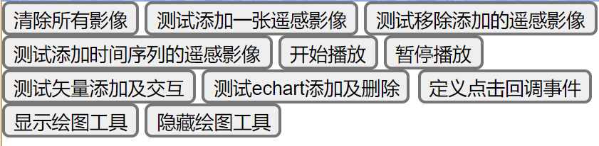

地图接口 apis 使用说明

> 由其他页面通过 iframe 的形式，向父级暴露一个调用页面中地图的总接口

[用于被其他页面通过iframe调用的页面](./../public/map.html)

[接口文件](./../public/lib/index/apis.js)

[使用示例](./../public/testMapIframe.html)



- 总入口写法

父级页面通过 iframe 引入，并定义一个全局的 initOk 方法用于通知地图加载完成事件

在该项目中，```window.initOk```方法定义在 [index.vue](./../src/views/index.vue) 的 mounted 方法中

```html
<iframe src="./pathto/map.html"></iframe>
<script >
    window.initOk = function (e) {
        window.mapApis = map.contentWindow.apis;
    }
</script>
```

- 时间序列遥感影像的使用

[干旱指数](./../src/views/遥感监测/干旱指数/)

```javascript
// 时间是一直在流动的，因此有必要先暂停时间
mapApis.stop();
// 移除原有的时间影像（如果有的话）
mapApis.removeTimelineLayer();
// 创建新的时间轴
mapApis.addTimelineLayer(
    $this.year + '-1-1',
    $this.year + "-12-31",
    window.allUrls.geoserver + "draught/wms",
    getLayerParameter(type)
    ,function ({year,month,day,dd}) {
        let eday = parseInt(dd / 8) + 1;
        if (!edays.includes(eday)) {
            //window.vueMessage(`没有日期为 ${$menus.year}年 ${eday}旬 的影像`,'info');
            let ind = 0;
            for (;ind <  edays.length;ind++) {
                if ( edays[ind] > eday) break;
            }
            if (ind === 0) eday = edays[ind]; else eday = edays[ind - 1];
        }
        return {
            layers: `draught:${type.toLowerCase()}_${year}_${eday}`,
            query_layers: `draught:${type.toLowerCase()}_${year}_${eday}`,
            // layers: `xj_test:vhi${year}${eday}`,
            // query_layers: `xj_test:vhi${year}${eday}`,
        };
    },function (j,{Y,M,D,date,day}) {
        // console.log(date);
        // console.log(day);
        $this.eday = parseInt(day / 8) + 1;
        $this.currentTime = `${$this.year}年${$this.eday}期（旬）`;
    });
```
