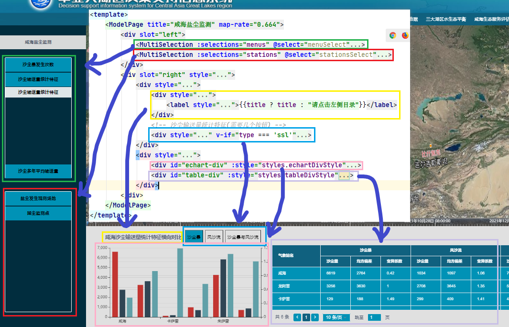
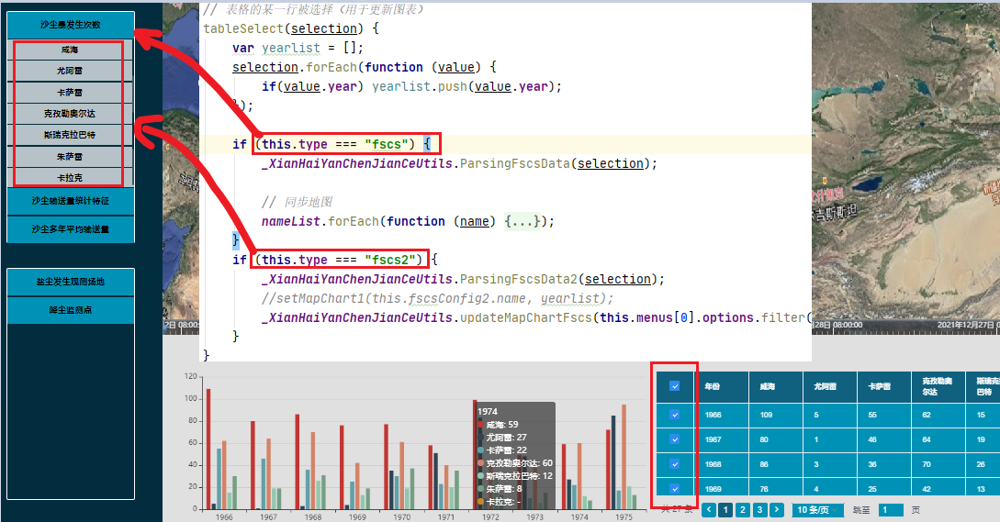
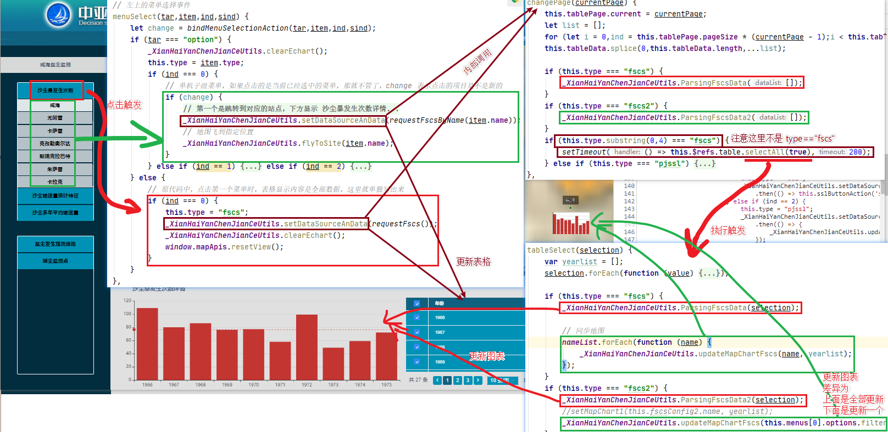
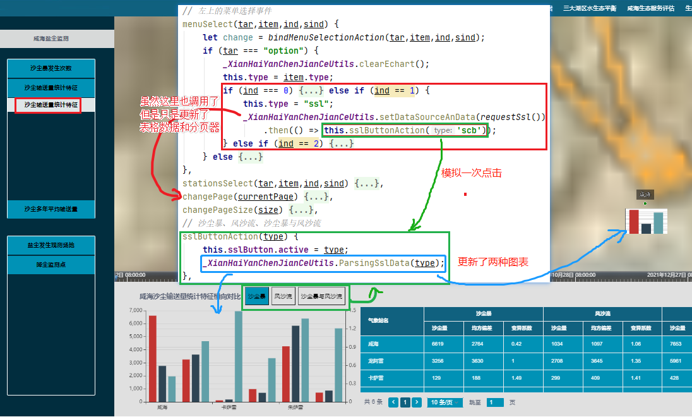
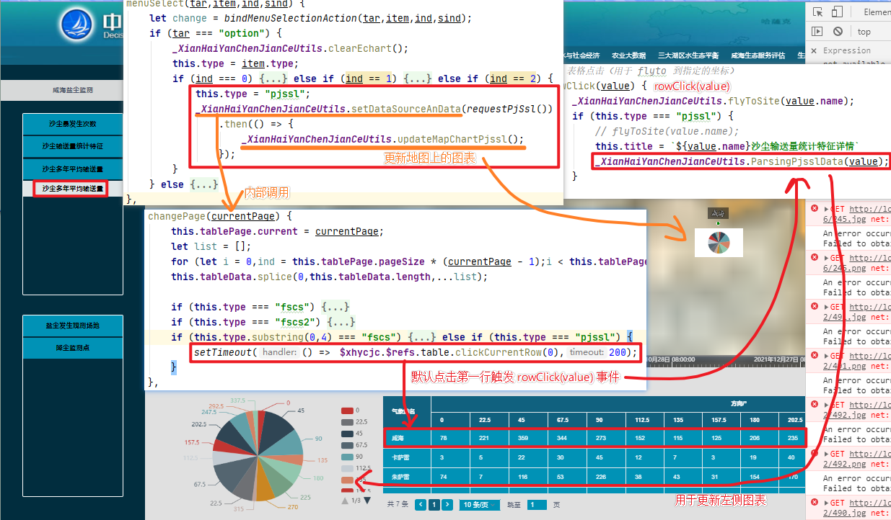

- 页面结构



- 内容说明

下部分菜单点击毫无效果，只是一个摆设

- 代码执行流程

1._XianHaiYanChenJianCeUtils.setDataSourceAnData 这个函数主要做三件事情

```text
1. 完成 promise 并将数据存储到 _XianHaiYanChenJianCeUtils.tmpData 中
2. 同步分页组件的内容
3. 调用组件的 changePage(1) 方法
```

2.$vue.changePage



```text
会执行页码修改的相关操作，同时如果当前为 “沙尘暴发生次数” 菜单中的任一项
    将自动重置地图中的图表
```

3.$vue.tableSelect

```text
这个方法
    如果在 菜单选择为 “沙尘暴发生次数” 情况下，执行
        1.更新左下角的 echart 图表
        2.更新地图中的 echart 图表
```

4.沙尘暴发生次数菜单执行流程如下

下图中 ```更新表格``` 事件是在 ```changePage``` 中 ```this.tableData.splice``` 语句中触发的



5.沙尘输送量统计特征菜单执行流程如下



6.沙尘多年平均输送量

