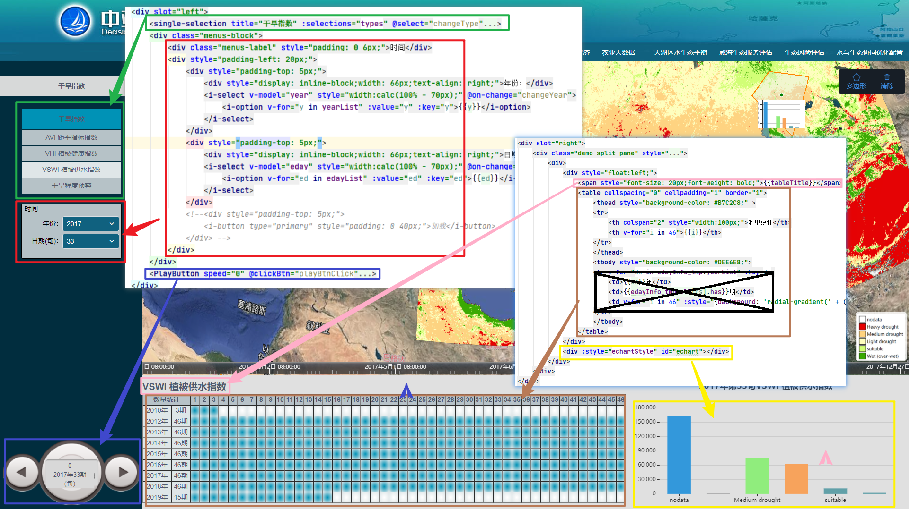
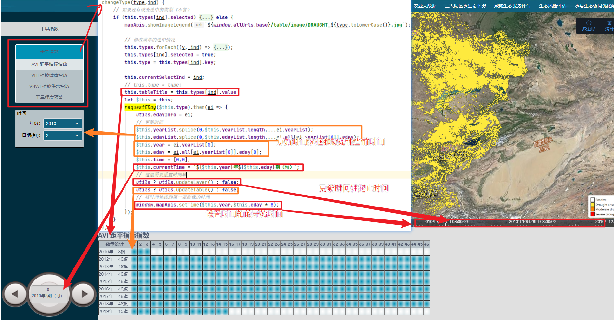
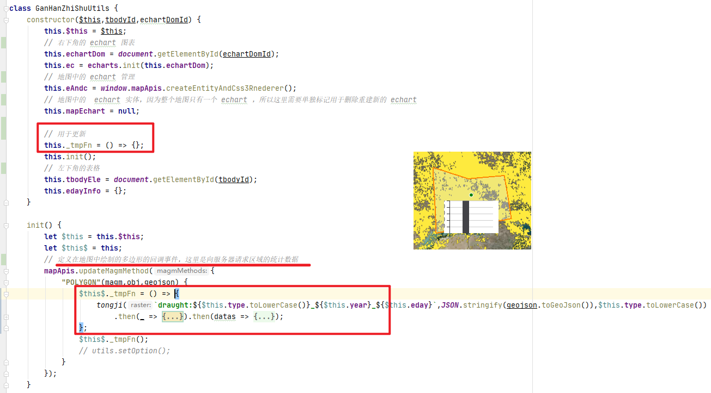

[GanHanZhiShu.vue](./../src/views/遥感监测/干旱指数/GanHanZhiShu.vue)

- 页面结构



- 组件初始化时执行以下内容

```javascript
// 创建 GanHanZhiShuUtils 实例
utils = new GanHanZhiShuUtils(this,"draught_tbody","draught_echart");
// tbodyId = draught_tbody 是图片 左下角的 统计表格
// echartDomId = draught_echart 是图片 右下角的 echart 图表的 dom
// 同时会重建 eAndc 对象，并注意 _tmpFn 的作用
```

- 菜单点击执行流程



- GanHanZhiShuUtils._tmpFn

这个函数时用于记录 统计接口的 查询信息，用于在更新显示新的图片时 能正常自动执行统计接口，更新图表信息

